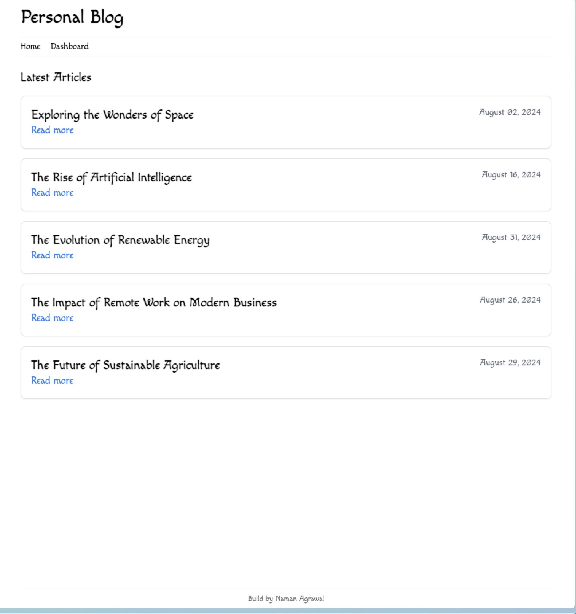
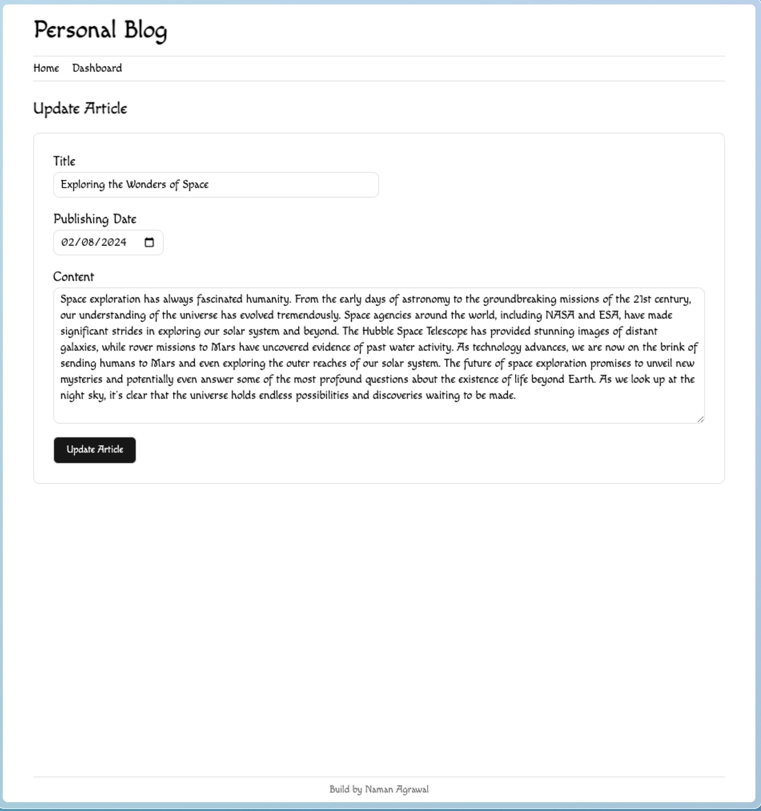
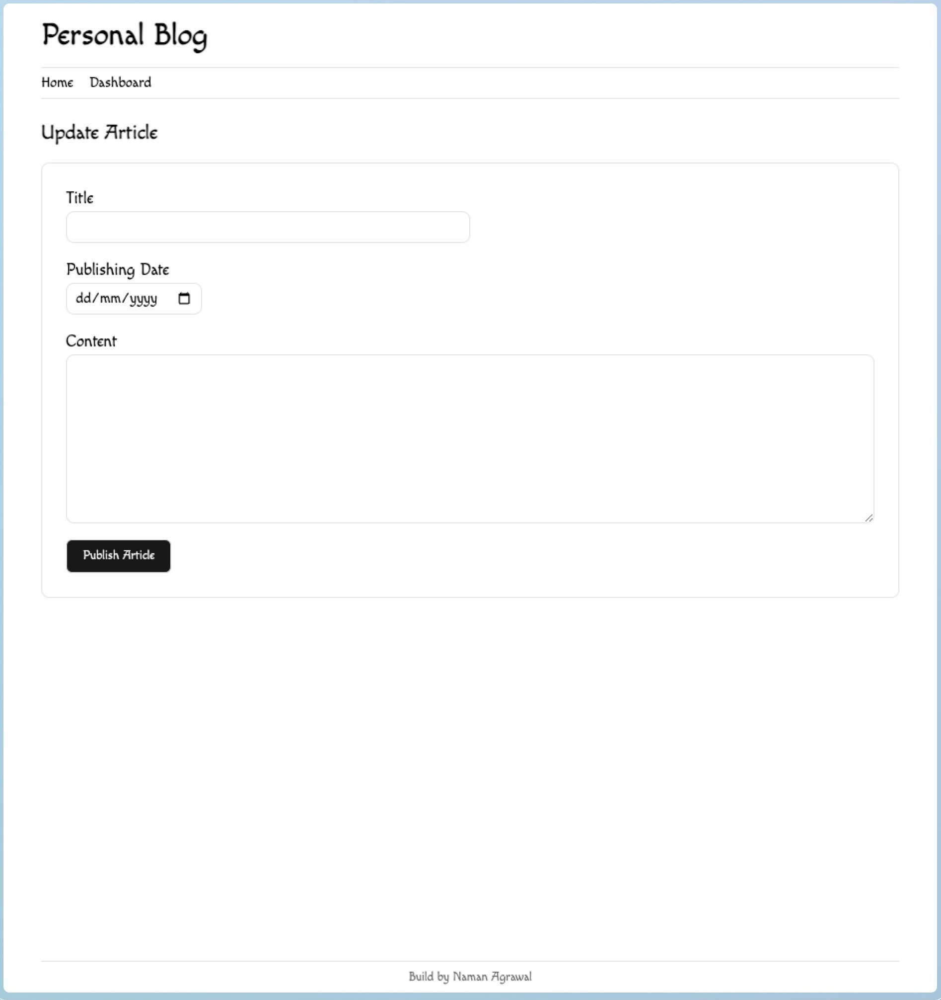
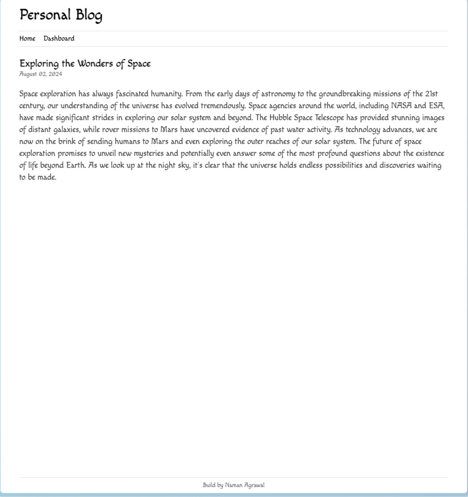
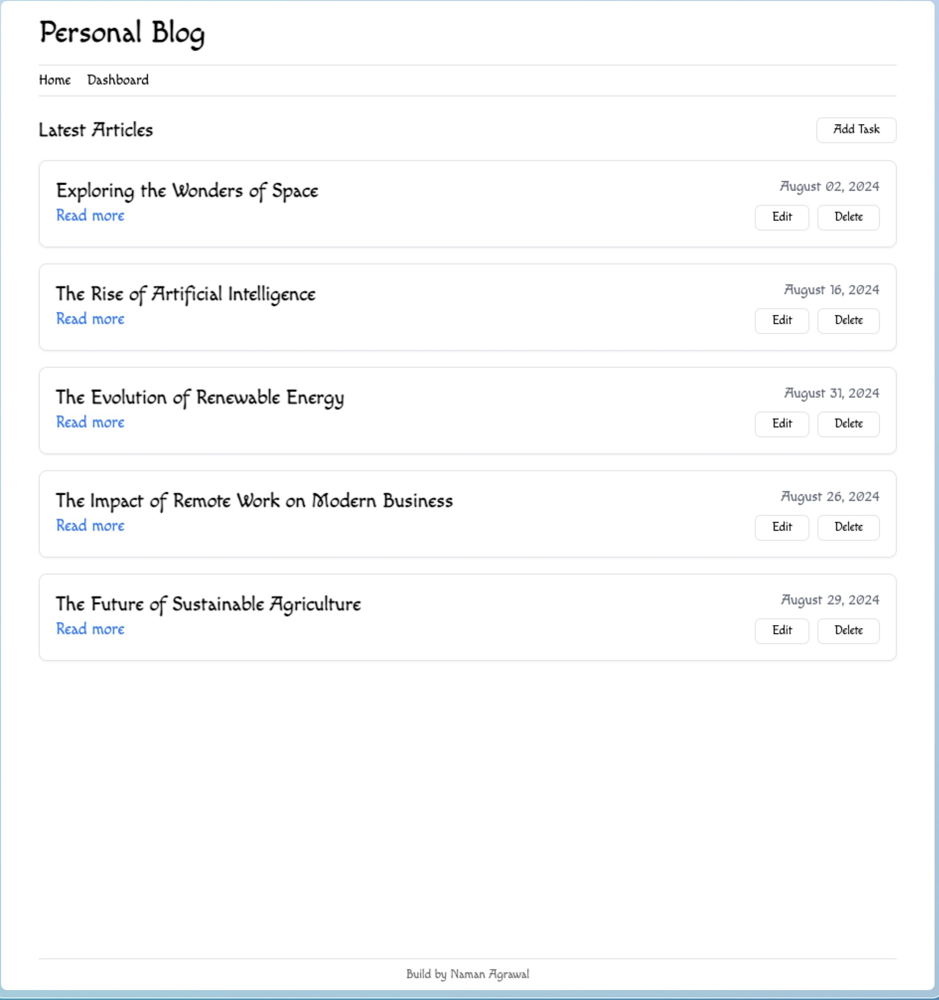
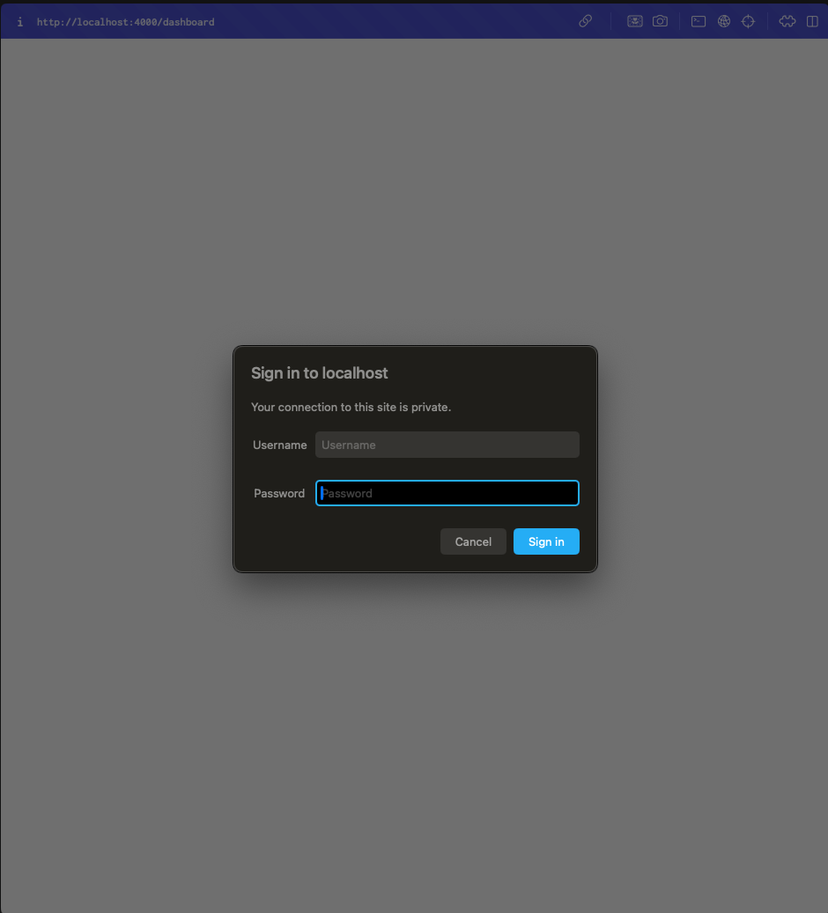

# Go Blog Project

Welcome to the Go Blog Project! This project demonstrates a simple blog application built with Go, using the Chi router and JSON file storage. The application features basic CRUD operations for articles, including create, read, update, and delete functionalities.

#### Project URL: [https://roadmap.sh/projects/personal-blog](https://roadmap.sh/projects/personal-blog)

## Project Structure

- `pkg/`: Contains the main application logic, including handlers and models.
- `ui/html/`: Contains HTML templates for rendering views.
- `docs/images/`: Contains images used for documentation.
- `pkg/data/articles.json`: JSON file storing article data.

## Features

- **Home Page**: Displays a list of articles with options to view, edit, and delete.
- **Article View**: Shows details of a specific article.
- **Dashboard**: Provides an overview and management options for articles.
- **Create, Update, Delete**: Manage articles through forms and routes.

## Installation

To get started with this project, clone the repository and navigate to the project directory:

```sh
git clone https://github.com/namanag0502/go-blog-tmpl.git
cd go-blog-tmpl
```

Ensure you have Go installed on your system. You can download it from [the official Go website](https://golang.org/dl/).

## Running the Application

To run the application, use the following commands:

```sh
go mod tidy
make server
```

The application will start on `http://localhost:4000`.

## API Endpoints

- **GET /**: Displays the home page with a list of articles.
- **GET /view/{id}**: View details of a specific article.
- **GET /dashboard**: View and manage articles.
- **GET /new**: View form to create a new article.
- **POST /create**: Create a new article.
- **GET /edit/{id}**: View form to update an existing article.
- **POST /update/{id}**: Update an existing article.
- **POST /delete/{id}**: Delete an article by ID.

## Frontend Templates

- `base.tmpl`: The base template with common layout elements.
- `home.tmpl`: Template for the home page.
- `view.tmpl`: Template for viewing a single article.
- `dashboard.tmpl`: Template for managing articles.

## Images

Here are some images related to the project:

<div>
  
  
  
</div>
<div>
  
  
  
</div>

## Contributing

Contributions are welcome! Please follow these steps to contribute:

1. Fork the repository.
2. Create a new branch for your feature or bug fix.
3. Make your changes and commit them with clear messages.
4. Push your changes to your forked repository.
5. Submit a pull request.

## License

This project is licensed under the MIT License - see the [LICENSE](LICENSE) file for details.

## Contact

For any questions or feedback, feel free to reach out:

- **Email**: naman.agrawal.na05@gmail.com
- **GitHub**: [namanag0502](https://github.com/namanag0502)
